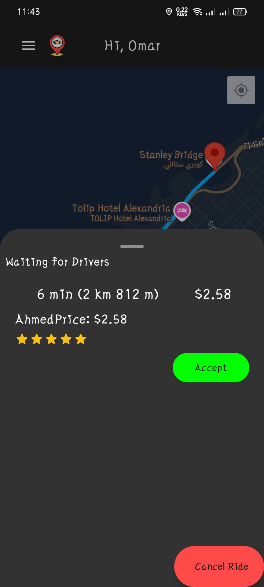
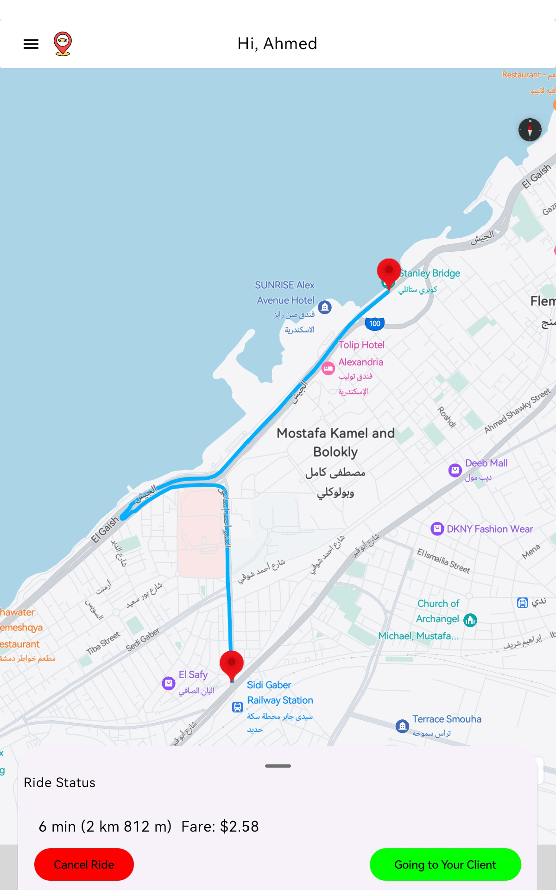

# Get Ride Demo

**GetRide** is a multi-platform mobile application developed with Kotlin Multiplatform Mobile (KMM), offering a full-featured ride-sharing service. The app integrates advanced ride management, Stripe payment processing, and Google Maps for navigation, while leveraging Supabase for real-time data handling and secure authentication. With support for both Android (Jetpack Compose) and iOS (SwiftUI), GetRide delivers a seamless user experience across platforms.

## Features

### Core Functionality

- **User Authentication**: GetRide uses **Supabase Authentication** to securely manage user sign-up, sign-in, and session handling across devices.
- **Ride Management**: Users can request and track rides in real-time. Drivers receive filtered ride requests that show only nearby clients, making the process more efficient.
- **Driver Rating System**: Users can rate drivers after completing a trip. The driver's rating is updated instantly using a custom SQL function.
- **Trips and Payment History**: Users can access a detailed history of their past trips and payment transactions within the app.
- **Stripe Payment Integration**: Payments are processed securely using Stripe, enabling users to complete transactions with ease.


### Google Maps API Integration

- **Route Calculation**: Fetches and decodes optimized routes between start and end locations for smooth navigation during rides.
- **Location Search**: Users can search for places using text input, improving the flexibility of destination choices.
- **Reverse Geocoding**: Fetches place names and details from latitude and longitude coordinates, ensuring accurate location services.


### Supabase Integration

- **Authentication**: Secure user authentication using Supabase, allowing for email-based sign-ups, logins, and session persistence.
- **Real-time Data**: Supabase handles real-time synchronization of ride requests, trip updates, and other user interactions.
- **Data Storage**: All user and trip-related data are stored securely, with robust permissions and scalability using Supabase.


### Multi-Platform Support

GetRide is built using **Kotlin Multiplatform Mobile (KMM)** for shared business logic across Android and iOS, while using native UI frameworks for each platform:
- **Android**: The app uses **Jetpack Compose** for a modern and reactive user interface.
- **iOS**: The app is powered by **SwiftUI**, providing a smooth and native experience for iOS users.

### Technologies Used

- **Kotlin Multiplatform Mobile (KMM)**: Shared business logic for iOS and Android platforms.
- **Jetpack Compose**: Modern UI toolkit for Android development.
- **SwiftUI**: Native UI framework for iOS development.
- **Supabase**: Handles authentication, real-time data, and secure backend storage.
- **Stripe API**: Processes payments and manages transactions.
- **Google Maps API**: Provides route calculation, location search, and reverse geocoding.
- **Ktor & kotlinx.serialization**: For API communication and data serialization.


## Installation

To install and run **GetRide** locally, follow these steps:
1. **Clone the repository**:
    ```bash
    git clone https://github.com/OmAr-Kader/GetRide.git
    ```
2. **Open the project** in Android Studio or any IDE that supports Kotlin Multiplatform.
3. **Sync dependencies** to ensure all libraries are installed.
4. **Configure Supabase and Stripe**:
    - Create a Supabase project and retrieve your API URL and API key.
    - Set up a Stripe account and obtain your Stripe API key and account ID.
    - Add these configurations to your `local.properties` file:
    ```properties
    SUPABASE_URL=your_supabase_url
    SUPABASE_API_KEY=your_supabase_api_key
    STRIPE_API_KEY=your_stripe_api_key
    STRIPE_ACCOUNT_ID=your_stripe_account_id
    MAPS_API_KEY=your_google_maps_api_key
    ```
5. **Run the application**:
    - **For Android**: Run the app on an emulator or physical device.
    - **For iOS**: Open the project in Xcode, build, and run it on a simulator or a connected iPhone.


## Contribution

We welcome contributions to improve GetRide! To contribute:
1. Fork the repository.
2. Create a feature branch.
3. Submit a pull request with a detailed description of your changes.

## 🔗 Links & Dependencies

[](https://kotlinlang.org/docs/multiplatform.html)

[](https://developers.google.com/maps/documentation/ios-sdk/overview)

[](https://developers.google.com/maps/documentation/android-sdk/overview)

[](https://developer.android.com/studio?gclsrc=aw.ds)

[](https://developer.apple.com/documentation/xcode)

[](https://developer.apple.com/tutorials/app-dev-training)

[](https://developer.apple.com/xcode/swiftui/)

[](https://www.jetbrains.com/help/kotlin-multiplatform-dev/compose-multiplatform-getting-started.html#join-the-community)

[](https://github.com/InsertKoinIO/koin)

[](https://github.com/Swinject/Swinject)

[](https://supabase.com/docs/reference/kotlin/installing)

<!--suppress CheckImageSize -->
Screenshot
-------------

### Android

#### Client
<table>
    <tr>
      <td>  </td>
      <td>  </td>
    </tr>
    <tr>
      <td>  </td>
      <td>  </td>
    </tr>
    <tr>
      <td>  </td>
      <td>  </td>
    </tr>
    <tr>
      <td>  </td>
    </tr>
</table>

#### Driver
<table>
    <tr>
      <td>  </td>
      <td>  </td>
    </tr>
    <tr>
      <td>  </td>
      <td>  </td>
    </tr>
    <tr>
      <td>  </td>
      <td>  </td>
    </tr>
    <tr>
      <td>  </td>
    </tr>
</table>


### IOS

#### Client
<table>
    <tr>
      <td>  </td>
      <td>  </td>
    </tr>
    <tr>
      <td>  </td>
      <td>  </td>
    </tr>
    <tr>
      <td>  </td>
      <td>  </td>
    </tr>
    <tr>
      <td>  </td>
    </tr>
</table>

#### Driver
<table>
    <tr>
      <td>  </td>
      <td>  </td>
    </tr>
    <tr>
      <td>  </td>
      <td>  </td>
    </tr>
    <tr>
      <td>  </td>
      <td>  </td>
    </tr>
    <tr>
      <td>  </td>
    </tr>
</table>
